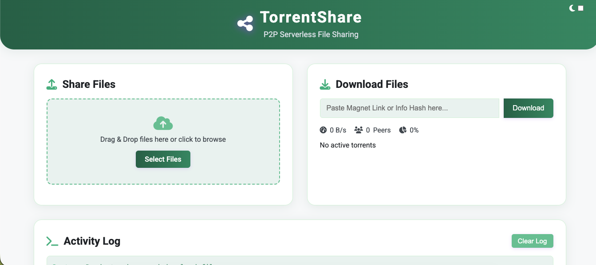
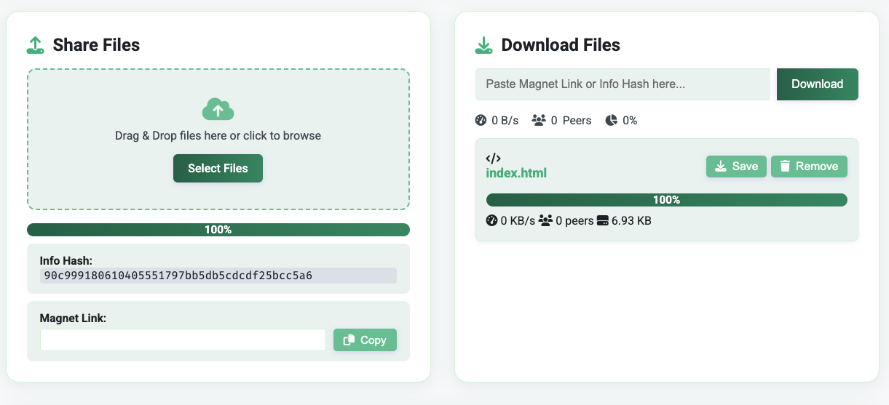

# P2P File Sharing & Streaming Web Application (MiniUI)

## 🚀 Overview
MiniUI is a browser-based peer-to-peer (P2P) file sharing application that enables users to transfer files directly between browsers without any centralized server. It also supports progressive media streaming, allowing users to play video/audio files while they are still downloading.

This project demonstrates real-time communication, distributed architecture, and client-side execution using modern web technologies.

---

## 🔧 Tech Stack
- **Frontend:** HTML, CSS, JavaScript  
- **P2P Communication:** WebRTC  
- **File Sharing & Streaming:** WebTorrent  

---

## ✨ Features
- **Serverless File Sharing:** Direct browser-to-browser file transfer using WebRTC  
- **Progressive Streaming:** Play media files while downloading  
- **Real-time Tracking:** Monitor download speed, progress, and peer connections  
- **User-Friendly Interface:** Clean UI with drag-and-drop file upload  
- **Magnet Link Support:** Share files using generated magnet links  
- **Dark Mode:** Toggle between light and dark themes  
- **Activity Logs:** Track application events in real-time  

---

## 🧠 How It Works
- Files are converted into torrent data in the browser  
- Peers connect directly using WebRTC (no backend server)  
- Data is transferred in chunks between peers  
- Media files can be streamed while downloading using WebTorrent  

---

## 📦 Getting Started

### Run Locally
1. Clone the repository:
   ```bash
   git clone https://github.com/yourusername/p2p-file-sharing-miniui.git


ScreenShot for this project 
1- 
2-


🔐 Security Notes
	•	File transfer occurs directly between peers (no central storage)
	•	No backend server is involved
	•	Browser permissions may be required for certain media features


🌐 Browser Compatibility
Works best on modern browsers:
	•	Google Chrome
	•	Mozilla Firefox
	•	Microsoft Edge
	•	Safari (latest versions)

📌 Future Improvements
	•	Enhanced encryption for data transfer
	•	Multi-peer optimization for faster downloads
	•	Improved UI/UX and mobile responsiveness

👨‍💻 Author

Piyush Singh
	•	GitHub: https://github.com/PiyushSingh5002
	•	LinkedIn: https://www.linkedin.com/in/piyush-singh-a91382345/

⭐ Acknowledgements
	•	WebTorrent library
	•	WebRTC technology